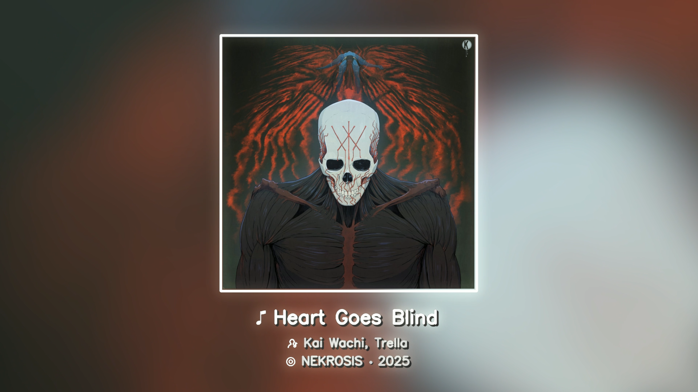
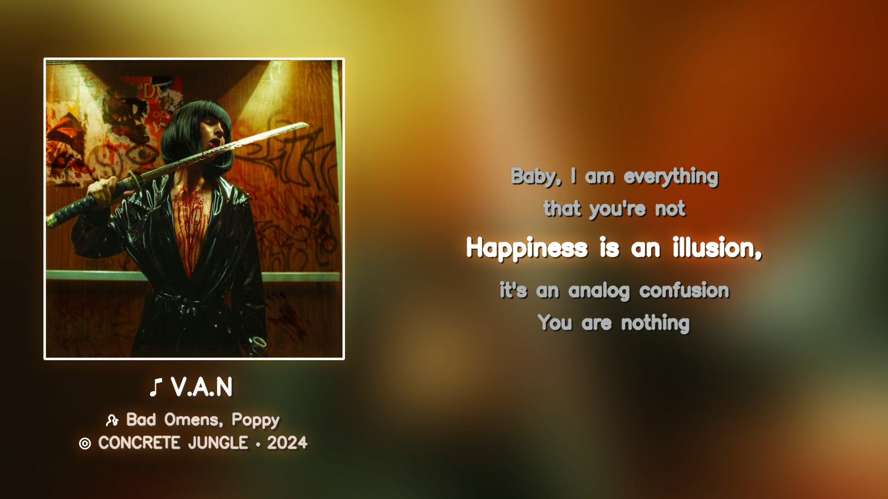

# Beautiful Lyric Video Creator

A high-performance, GPU-accelerated tool to automatically generate aesthetic music videos with synchronized lyrics. This project leverages CUDA for fast image processing and FFmpeg for robust video encoding.

## Key Features

- **GPU Acceleration**: Uses CuPy and custom CUDA kernels for real-time visual effects (blur, glow, blending).
- **Synchronized Lyrics**: Parses `.lrc` files to display lyrics in sync with the audio.
- **Dynamic Visuals**:
  - **With Lyrics**: Side-aligned cover art with a beautiful, glowing lyric display.
  - **Without Lyrics**: Centered, enlarged cover art with a decorative frame and metadata text.
- **Batch Processing**: Automatically scans the `songs` folder and processes all tracks in numerical order.
- **Smart Color Matching**: Analyzes the album cover to generate a matching background and glow effects.

---

## Prerequisites

Before running the script, you must ensure that **FFmpeg** and **CUDA** (v13 recommended) are properly installed on your system.

### 1. FFmpeg Installation

FFmpeg is required for audio analysis and video encoding.

1.  **Download**: Go to the [FFmpeg builds page](https://gyan.dev/ffmpeg/builds/) (or use chocolately) and download the "release-full" build.
2.  **Extract**: Unzip the downloaded file to a permanent location, e.g., `C:\ffmpeg`.
3.  **Add to Path**:
    -   Search for "Edit the system environment variables" in Windows Start.
    -   Click **Environment Variables**.
    -   Under **System variables**, find the `Path` variable and click **Edit**.
    -   Click **New** and add the path to the `bin` folder inside your FFmpeg directory (e.g., `C:\ffmpeg\bin`).
    -   Click **OK** to save.
4.  **Verify**: Open a new terminal and run:
    ```bash
    ffmpeg -version
    ```

### 2. CUDA Toolkit Installation

This project requires an NVIDIA GPU and the CUDA Toolkit.

1.  **Check GPU**: Ensure you have an NVIDIA GPU compatible with CUDA.
2.  **Download**: Visit the [NVIDIA CUDA Toolkit Archive](https://developer.nvidia.com/cuda-toolkit-archive).
3.  **Select Version**: Choose **CUDA 13.x** (recommended).
4.  **Install**: Run the installer and follow the on-screen instructions. Select "Express" installation.
5.  **Verify**: Open a terminal and run:
    ```bash
    nvcc --version
    ```

---

## Installation

1.  **Clone the Repository**
    ```bash
    git clone https://github.com/albertnica/Beautiful-Lyric-Video-Creator
    cd Beautiful-Lyric-Video-Creator
    ```

2.  **Create a Virtual Environment** (Recommended)
    ```bash
    python -m venv venv
    venv\Scripts\activate
    ```

3.  **Install Dependencies**
    ```bash
    pip install -r requirements.txt
    ```

    > **Note on CuPy**: The `requirements.txt` includes `cupy-cuda13x` by default. If you installed, for example, CUDA 12, please uninstall it and install `cupy-cuda12x` instead:
    > ```bash
    > pip uninstall cupy-cuda13x
    > pip install cupy-cuda12x
    > ```

---

## Usage

1.  **Prepare Folders**:
    -   `songs/`: Place your audio files here (`.flac` is mandatory).
    -   `lyrics/`: Place your `.lrc` files here. The lyrics filenames must match the audio filenames.

2.  **Run the Script**:
    ```bash
    python main.py
    ```

3.  **Output**:
    -   Generated videos will be saved in the `output/` folder.

---

## Screenshots

### **Cover-Only Mode**
  

### **Lyrics Mode**
  

---

## Video Comparison

Here is a comparison between the previous version and the current enhanced version.

### **Previous Version (v0.0)**
<video src="https://github.com/albertnica/Beautiful-Lyric-Video-Creator/blob/main/gh/comparison_old.mp4?raw=true" width="900" controls></video>

### **Current Version (v1.0)**
<video src="https://github.com/albertnica/Beautiful-Lyric-Video-Creator/blob/main/gh/comparison_new.mp4?raw=true" width="900" controls></video>

---

## Changelog v1.0

### Major Improvements

-   **Performance Boost**: Drastic reduction in processing time (from ~1 min/song to ~25 sec/song on a 3060Ti) while improving video quality.
-   **Enhanced Visuals**: Added glow effects, dynamic background with spinning cover and better blending.
-   **Lyrics Engine Overhaul**: Improved font rendering, spacing and alignment. Implemented an automatic line-splitting system for long lyrics to ensure readability.
-   **Customization**: Expanded configuration options for personalization.
-   **Assets**: Added support for custom icons (title, artist, album).
-   **Documentation**: Improved documentation and readablity of the code.

---

## For your information

This script hardly realies on .FLAC files cover art (metadata) and .LRC files. I have other works that focuse on adding this features to your music library and they can be found under the [Music-Metadata-Handler](https://github.com/albertnica/Music-Metadata-Handler) and [Automatic-Lyrics-Synchronizer](https://github.com/albertnica/Automatic-Lyrics-Synchronizer) repositories.